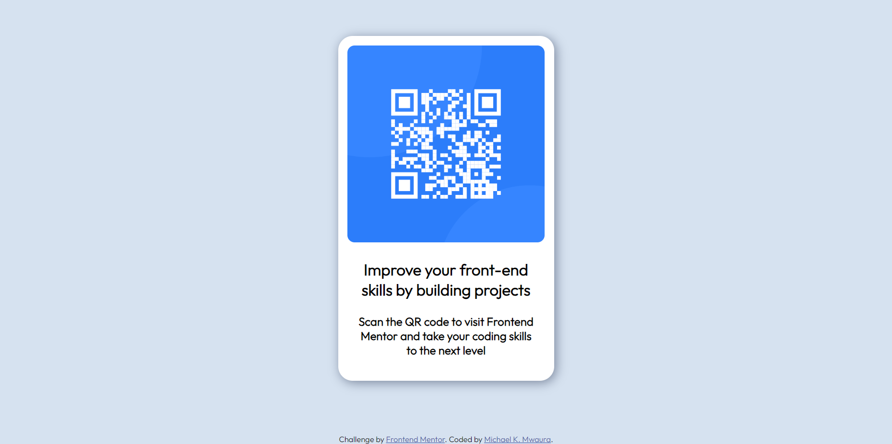

## Welcome! 👋

This is my QR code component project!

## Table of contents

  - [Screenshot](#screenshot)
  - [Links](#links)
  - [Built with](#built-with)
- [Author](#author)

### Screenshot

### Links

- Solution URL: [Add solution URL here](https://your-solution-url.com)
- Live Site URL: [Add live site URL here](https://your-live-site-url.com)

### Built with

- Semantic HTML5 markup
- CSS custom properties
- Flexbox
- CSS Grid
- Mobile-first workflow

## Author

- Frontend Mentor - [@michaelkmwaura](https://www.frontendmentor.io/profile/michaelkmwaura)
- LinkedIn - [@michael-mwaura-221661265](https://www.linkedin.com/in/michael-mwaura-221661265/)
